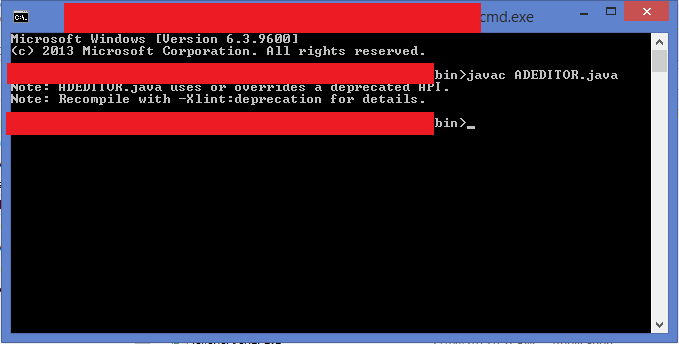
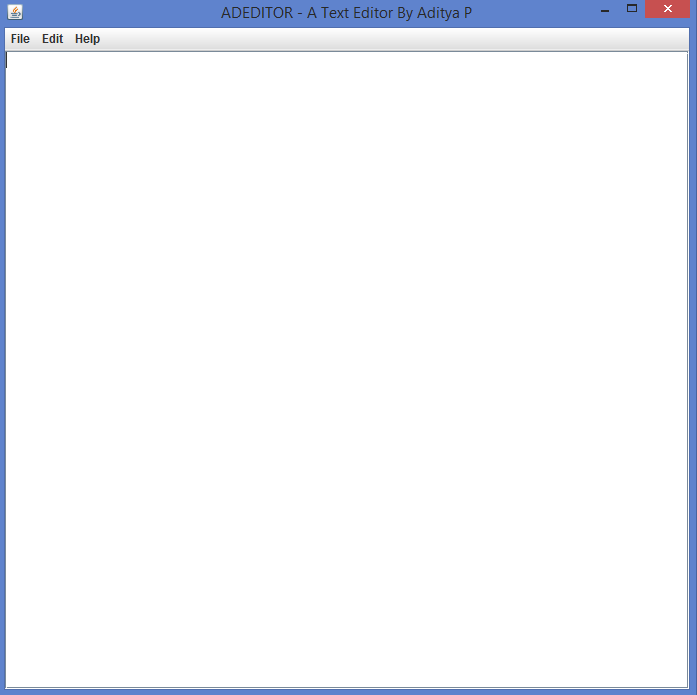

# ADEDITOR
This is a simple Text/code editor developed by Aditya P in JAVA. Suppose you have a text file or code in any language, you can easily edit your files with the help of **ADEDITOR**. You may get various features in this ADEDITOR.

# How to use ADEDITOR
First download the source file ADEDITOR.java in your pc. You should have java and its compiler in your computer. When you download the source file, cut it and paste it in the bin folder where you have installed the java. The bin file contains javac.exe, java.exe, etc. Now for windows, open the command prompt and change the directory of it to bin folder. Another simple way to do this is that you can copy the command prompt and paste it in the bin folder. 

  Now open the command prompt and type ***javac ADEDITOR.java***.

 It will show a warning. But neglect it as it is not an error. This will compile the java program and you can see another file ***ADEDITOR.class*** in the same bin folder. Now open the command prompt again and type ***java ADEDITOR***. This will open the ADEDITOR GUI and you can see the following window.

 Start editing by just typing random things. You can save the files, open the files, create new files, cut, copy, paste, etc etc. It can be used to edit any file which you want. So, start using ADEDITOR now!
